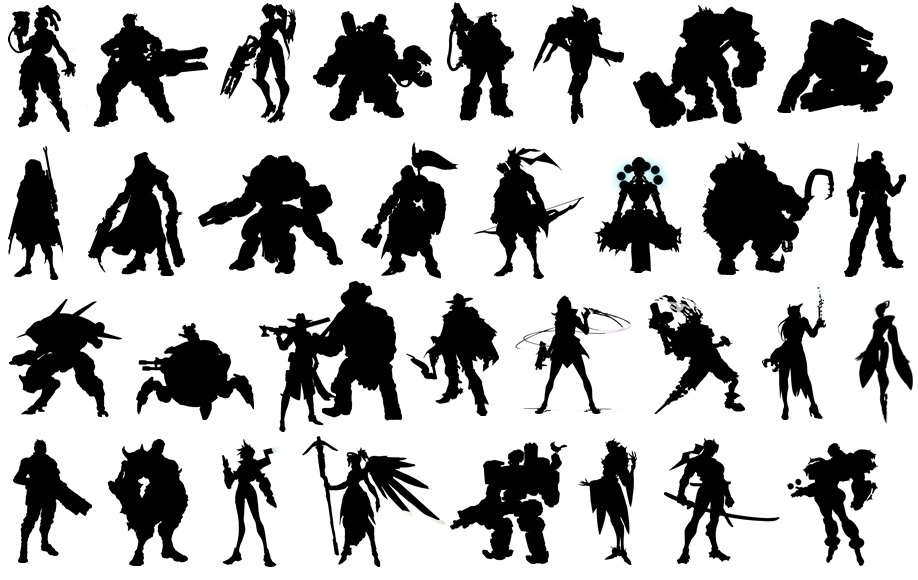

{{HEAD}}
title=How To Make Recognizable Character Designs
date=2023-08-19
description=Notes on how to create extremely recognizable character designs.

{{BODY}}

# How To Make Recognizable Character Designs

**This article is currently in note form.**

## Design Steps

Large, contrasting shapes first. Use as few details as possible, while still clearly communicating the character.

The entire design can be used to help inform the character’s personality.

The character design should be recognizable from as many angles as possible. The minimum should be the whole front and only the front of the head. Other good angles could be the back and only body.

Modifying existing elements and layering them can result in incredible unique and enticing results. Elements can be clothes, hair, accessories, etc. This also applies to body proportions. Modifications can be to make them shorter, longer, wider, tighter, cutting pieces out, making them asymmetrical, etc.

3-dimensionality and overall depth can come from layers. Underlays can be bodysuits, underwear, stockings, etc. Overlays can be jackets, capes, shawls, etc.

Details later.

Check value contrast in grayscale and modify colors to match.

Ensure that the amount of different colors and patterns is limited, to create a throughline.

Ensure that colors and patterns do not clash.

Certain poses can aid in communicating a character design, especially in instances where the design is less distinct in silhouette. **Examples:** Spider-Man.

## Visual & Recognition

Primary colors help with long-distance identification and distinguishing it from others at a glance.

Repeated colors and patterns help to create a throughline and a sense of consistency.

### Contrast

**Examples:**
Something dark and something colorful.
Something tight-fitting and something oversized.
Something patterned and something completely plain.
Light cloth and denim.

### Silhouette

The smallest amount of detail necessary to recognize a character.
A clear outline, recognizable even when completely silhouetted.
Internal details or partitions to aid an otherwise indistinguishable silhouette.

## Relationships, status, and personality

### Color

**Examples:**
The bright ginger hair of the Weasley family in Harry Potter.

### Repeating patterns / common elements

**Examples:**
A family crest.
A religious symbol, like a cross.

### Contrast with self

**Examples:**
Two-Face from Batman

### Contrast with others

**Examples:**
Rem and Ram from Re:Zero

Shape language can help communicate things about a character.

## Notes

[Shape language notes from Disney](https://www.waltdisney.org/sites/default/files/2020-04/T%26T_ShapeLang_v9.pdf)

[Silhouette notes from Disney](https://www.waltdisney.org/sites/default/files/2020-05/T%26T_Silhouette-final2.pdf)

[Refer to Overlord character designs](https://characterdesignreferences.com/art-of-animation-9/art-of-overlord)

[Refer to Hololive character designs](https://hololive.hololivepro.com/en/talents)

Refer to Overwatch character designs

