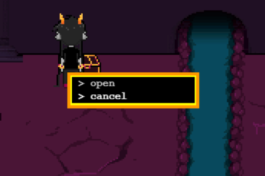

{{HEAD}}
title=Openbound - Actions
description=An in-depth tutorial of the Openbound game engine, Sburb. This section covers actions.

{{BODY}}

# Openbound - Actions

This article focuses on actions in the Sburb game engine. An action is essentially a command with some parameters. They are used for all interactions and usually make up a lot of the code, so make sure that you understand this concept well.

## Table Of Contents

-   [Overview](/openbound-overview)
-   [Basics](/openbound-basics)
    -   [Assets](/openbound-assets)
    -   [Dependencies](/openbound-dependencies)
    -   [Rooms](/openbound-rooms)
    -   [Characters](/openbound-characters)
    -   [Chests](/openbound-chests)
    -   [**Actions**](/openbound-actions)
    -   [Dialog sprites](/openbound-dialog-sprites)
    -   [Dialog](/openbound-dialog)
    -   [Triggers](/openbound-triggers)
    -   [Paths](/openbound-paths)
    -   [Templates](/openbound-templates)
-   [Good practice](/openbound-good-practice)
-   [Advanced](/openbound-advanced)
    -   [Text colours](/openbound-text-colours)
-   [Production](/openbound-production)
    -   [Build](/openbound-build)
    -   [Release](openbound-release)

## Structure

Actions are very common and can be found nearly every, though most commonly as a child of a sprite or trigger.

They have the following structure:

```xml
<action command='[COMMAND]'>
    <args>[ARGS]</args>
</action>
```

Some commands do not take arguments. In those situations, the `<args>` element does not need to be defined.

During some situations, the action may also require a name defined, as such:

```xml
<action command='[COMMAND]' name='[NAME]'>
    <args>[ARGS]</args>
</action>
```

## Usage

Action usage is relatively simple. The element is placed inside of the element which calls it. This may be a trigger, a sprite, a character, a sprite button, or another command.

Usage inside of a sprite looks like this, and applies to both triggers, sprites, characters, and sprite buttons:

```xml
<sprite>
    <action command='[COMMAND]' name='[NAME]'>
        <args>[ARGS]</args>
    </action>
</sprite>
```

Note the additional attribute `name`. This defines the name shown to the user in cases where a "chooser" box is shown.



# Commands

## talk

Activates a [dialog](/openbound-dialog). It takes one parameter that is a series of dialogs.

The syntax for this is specified on the [dialog](/openbound-dialog) page.

## randomTalk

Activates a [dialog](/openbound-dialog). It takes one parameter that is a series of dialogs.

The syntax for this is specified on the [dialog](/openbound-dialog) page.

## changeRoom

Changes the current [room](/openbound-rooms) to the specified room, and moves the [character](/openbound-characters) to it.

Syntax: "newRoom,newX,newY"

## changeRoomRemote

Changes the current [room](/openbound-rooms), to the specified room, and moves the [character](/openbound-characters) to it. If the specified SburbML file, which presumably contains the room being referenced, is not loaded yet, loads it first.

Syntax: "file,newRoom,newX,newY"

## playAnimation / startAnimation

Have the target [sprite](/openbound-sprites) play the specified [animation](/openbound-animations).

Syntax: sprite, animation

This command also supports "char" in place of "sprite" to play this animation on the player.

## changeChar

Change the player's character to the one specified. Also changes the room to the one in which the new character is standing.

Syntax: sprite

## changeFocus

Change the sprite the camera is focusing on.

Syntax: sprite

## playSong

Make the specified audio [asset](/openbound-assets) play as the background music.

Syntax: song

## playSound

Make the specified audio [asset](/openbound-assets) play as a sound effect.

Syntax: sound

## teleport

Calls the [changeRoom](#changeroom) command, and applies transportalizer effects.

Syntax: [changeRoom](#changeroom)'s syntax.

## teleportRemote

Calls the [changeRoomRemote](#changeroomremote) command, and applies transportalizer effects.

Syntax: [changeRoomRemote](#changeroomremote)'s syntax.

## playEffect

Play the specified [effect](/openbound-effects) at the specified location.

Syntax: effect, x, y

## openChest

Open the specified chest, display the specified sprite as its contents, and a message.

Syntax: chest, sprite, message

## waitFor

**_DEPRECATED; DO NOT USE_**

Take away player control, and wait for the specified trigger.

Syntax: see [trigger](/openbound-triggers) syntax

## macro

Execute an action and wait for all followups to finish.

Syntax: action tag

## deltaSprite

Move the sprite from it's current position by the specified amount in pixels.

Syntax: sprite, dx, dy

## moveSprite

Move the sprite to the specified location in pixels.

Sytnax: sprite, x, y

## addSprite

Add the specified sprite to the specified room.
Warning: if this sprite is in another room, it will now be in both!

Syntax: sprite, room

## removeSprite

Remove the specified sprite from the specified room. Even if a sprite isn't physically present anywhere, it can still be referenced by name.

Syntax: spriteName, roomName

## cloneSprite

Clone the specified sprite with a new name

Syntax: spriteName, newName

## playMovie

Play the specified movie [asset](/openbound-assets).

Syntax: movieName

## removeMovie

Stops the specified movie [asset](/openbound-assets).

(utility function used internally, not recommended for explicit use)

Syntax: movieName

## toggleVolume

Toggle the volume level (100->0->33->66->100). Used by the volume button.

Sytnax: takes no parameters

## addAction / addActions

Add the given [action](/openbound-actions)s to a sprite.

Syntax: SBURBML Action Syntax

## removeAction / removeActions

Remove the given [action](/openbound-actions)s from a sprite

Syntax: spriteName, actionName, actionName, actionName, ...
Note: Non-determinism may arise if multiple actions have the same name!

## presentAction / presentActions

Present the given [action](/openbound-actions)s to the user as a set of choices. Note that unlike normal, is not assumed to be a choice.

Syntax: SBURBML Action Syntax

## addWalkable

Add the specified path as a walkable to the specified room

Syntax: pathName, roomName

## addUnwalkable

Add the specified path as an unwalkable to the specified room

Syntax: pathName, roomName

## addMotionPath

Add the specified path as a motionpath to the specified room
Syntax: pathName, xtox, xtoy, ytox, ytoy, dx, dy, roomName

## removeWalkable

Remove the specified walkable from the specified room
Syntax: pathName, roomName

## removeUnwalkable

Remove the specified unwalkable from the specified room
Syntax: pathName, roomName

## walk

Make the character walk in the specified direction

Syntax: charName, direction

Valid directions are "Up", "Down", "Left", "Right", and "None".

## openLink

Opens an external link in a new tab

Syntax: url, displayText

## openDirect

Opens an external link in a new window

Syntax: url, displayText

## save

Save state to client storage

Syntax: isAuto, useLocal

## load

Load state from client storage

Syntax: isAuto, useLocal

## saveOrLoad

Display save/load options

Syntax: useLocal

## loadStateFile

Load in an additional SBURBML file

Syntax: path, keepOld

## setGameState

Change global game state

Syntax: gameState, value

## goBack

Move the character backwards

Syntax: charName

## fadeOut

Fade out to black

Syntax: none

## setButtonState

Change the state of the specified button

Syntax: buttonName, state

## changeMode

Change the engine mode

Syntax: modeName

Valid mode names are "wander" and "strife".

## try

Try to trigger the given triggers in order, if one succeeds, don't do the rest (they are like an else-if chain)

Syntax: SBURBML Trigger Syntax

## skipDialog

Skip the current conversation

Syntax: none

## follow

Set a character to follow another character

Syntax: followerName, leaderName

## unfollow

Set a character to stop following another character

Syntax: followerName

## addOverlay

Overlay a sprite over the game area (below the HUD)

Syntax: spriteName

## removeOverlay

Remove an overlay

Syntax: spriteName

## disableControl

Disables player control

## enableControl

Enables player control

## sleep

Wait for the specified event before continuing

Syntax: See trigger syntax

## pauseActionQueue / pauseActionQueues

Pauses one or more action queues.

Syntax: comma-separated action queue IDs

## resumeActionQueue / resumeActionQueues

Resumes one or more previously paused action queues.

Syntax: comma-separated action queue IDs

## cancelActionQueue / cancelActionQueues

Cancels one or more action queues.

Syntax: comma-separated action queue IDs

## pauseActionQueueGroup / pauseActionQueueGroups

Pauses one or more groups of action queues.

Syntax: comma-separated group names

## resumeActionQueueGroup / resumeActionQueueGroups

Resumes one or more previously paused action queues.

Syntax: comma-separated group names

## cancelActionQueueGroup / cancelActionQueueGroups

Cancels one or more action queue groups.

Syntax: comma-separated group names

## cancel

Takes no parameters, does nothing.
