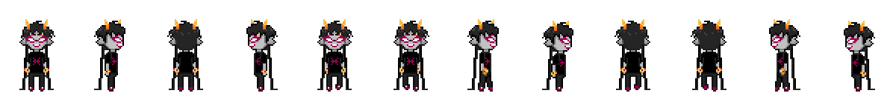
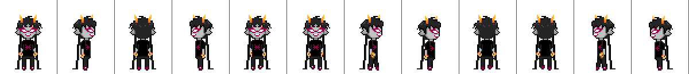

{{HEAD}}
title=Openbound - Characters
description=An in-depth tutorial of the Openbound game engine, Sburb. This section covers characters.

{{BODY}}

# Openbound - Characters

This article focuses on character creation in the Sburb game engine. A character is anything the player can become or anything that can follow the player. As the name entails, this is usually an actual character, like Meenah and Karkat in the sample. They can move around in 8 directions and have the necessary animations for that.

## Table Of Contents

-   [Overview](/openbound-overview)
-   [Basics](/openbound-basics)
    -   [Assets](/openbound-assets)
    -   [Dependencies](/openbound-dependencies)
    -   [Rooms](/openbound-rooms)
    -   [**Characters**](/openbound-characters)
    -   [Chests](/openbound-chests)
    -   [Actions/interactions](/openbound-actions)
    -   [Dialog sprites](/openbound-dialog-sprites)
    -   [Dialog](/openbound-dialog)
    -   [Triggers](/openbound-triggers)
    -   [Paths](/openbound-paths)
    -   [Templates](/openbound-templates)
-   [Advanced](/openbound-advanced)
    -   [Text colours](/openbound-text-colours)
-   [Production](/openbound-production)
    -   [Build](/openbound-build)
    -   [Release](openbound-release)

## Structure

It is generally good practice to place character definitions in separate files, like rooms. The official Openbound games use the `levels/[PROJECT]/chars/` directory, so I recommend that. Let us say that we are creating Meenah here, though she already exists in the sample project. The file that contains her definition would then be `levels/[PROJECT]/chars/meenah.xml`.

## File

A character file commonly contains both the character definition, dialogue sprite definitions, and the common command that allows the player to "be" them. A complete file example is included at the bottom of this tutorial. For now, I will cover only the most basic character definition. Below is an example:

```xml
<sburb description='meenah'>
  <classes>
    <character class='meenah' name='meenah' sx='-50' sy='-115' sWidth='100' sHeight='130' width='35' height='25' sheet='meenahSheet' state='walkFront' facing='Front'></character>
  </classes>

  <assets>
    <asset name='meenahSheet' type='graphic'>chars/meenah/meenah.png</asset>
  </assets>
</sburb>
```

## Sprite sheet

If you have read the [assets](/openbound-assets) section, you will already know how the asset definition works. This asset, however, is sheet containing several sprites, rather than a single illustration. Meenah's sprite sheet looks like this:



The character sprite sheets all follow the exact same format. The order is as follows, from left to right:

-   Idle (down)
-   Idle (right)
-   Idle (up)
-   Idle (left)
-   Walk (down) frame 1
-   Walk (down) frame 2
-   Walk (right) frame 1
-   Walk (right) frame 2
-   Walk (up) frame 1
-   Walk (up) frame 2
-   Walk (left) frame 1
-   Walk (left) frame 2

The order of sprites must match exactly.

While the spritesheet can be any size you wish, the area attributed to each sprite must be the same. For example, Meenah's sprite sheet is 1200 pixels wide and 130 pixels tall, and a sprite sheet contains 12 sprites. Therefore, the area attributed to each sprite is 100 pixels wide and 130 pixels tall.

The illustration below visualizes this by placing a red line along the right side of each sprite to show you the exact size of them. As you can tell, Meenah is roughly centered in all of them.



You may also notice that each of Meenah's sprites are 2 times their actual pixel size. This applies to all graphic assets and is **not** so more detail can be added.

The reason this is done is because of HTML5's upscaling algorithm, which smooths out pixel art. To keep the pixel art crisp and clear, all sprites must be rendered 1:1. This is not usually a problem, but Openbound wants the sprites to be larger and clearer on the screen, so they prefer everything to be rendered at 2 times the size. To keep the same look, I recommend that you abide by this rule, as well.

## Character

## Complete file

This is a complete example of what a character file usually looks like. It may include some concepts which have yet to be explained.

```xml
<sburb description='meenah'>
  <classes>
    <!-- Default dialog position values -->
    <animation class='meenah-dialog' frameInterval='6' x='-180' y='-524' />

    <!-- Character definition -->
    <character class='meenah' name='meenah' sx='-50' sy='-115' sWidth='100' sHeight='130' width='35' height='25' sheet='meenahSheet' state='walkFront' facing='Front'></character>

    <!-- Common "be" command -->
    <action class='beMeenah' name='Be Meenah.' command='macro'>
      <args>
        <action command='changeChar' noDelay='true'>
          <args>meenah</args>
          <action command='playSong' noDelay='true'>
            <args>meenahSong,0</args>
          </action>
        </action>
      </args>
    </action>
  </classes>

  <assets>
    <!-- the sprite sheet containing all her animations -->
    <asset name='meenahSheet' type='graphic'>chars/meenah/meenah.png</asset>

    <!-- her background music -->
    <asset name='meenahSong' type='audio'>audio/music/muscles.oga;audio/music/muscles.mp3</asset>

    <!-- her dialog sprites -->
    <asset name='meenah_talk' type='graphic'>dialogs/meenah/meenah_talk.png</asset>
    <asset name='meenah_angrytalk' type='graphic'>dialogs/meenah/meenah_angrytalk.png</asset>
    <asset name='meenah_annoyed' type='graphic'>dialogs/meenah/meenah_annoyed.png</asset>
    <asset name='meenah_ohyes' type='graphic'>dialogs/meenah/meenah_ohyes.png</asset>
  </assets>

  <hud>
    <dialogsprites>
      <animation name='meenah_talk' class='meenah-dialog' sheet='meenah_talk' length='2'/>
      <animation name='meenah_angrytalk' class='meenah-dialog' sheet='meenah_angrytalk' length='2'/>
      <animation name='meenah_annoyed' class='meenah-dialog' sheet='meenah_annoyed'/>
      <animation name='meenah_ohyes' class='meenah-dialog' sheet='meenah_ohyes'/>
    </dialogsprites>
  </hud>
</sburb>
```
