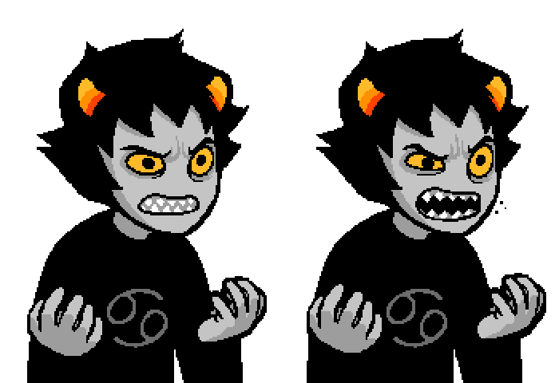

{{HEAD}}
title=Openbound - Dialog Sprites
description=An in-depth description of dialog sprites in the Openbound game engine.

{{BODY}}

# Openbound - Dialog Sprites

Dialog sprites are the sprites rendered in the dialog system. They require some special definitions and sizes, which is why this is kept separate from sprites.

## Table Of Contents

-   [Overview](./openbound-overview)
-   [Basics](./openbound-basics)
    -   [Assets](./openbound-assets)
    -   [Dependencies](./openbound-dependencies)
    -   [Rooms](./openbound-rooms)
    -   [Sprites](./openbound-sprites)
    -   [Animations](./openbound-animations)
    -   [Characters](./openbound-characters)
    -   [Actions](./openbound-actions)
    -   [Dialog](./openbound-dialog)
    -   [**Dialog sprites**](./openbound-dialog-sprites)
    -   [Triggers](./openbound-triggers)
    -   [Paths](./openbound-paths)
    -   [Templates](./openbound-templates)
    -   [Game State](./openbound-gamestate)
    -   [Effects](./openbound-effects)
-   [Good practice](./openbound-good-practice)
-   [Advanced](./openbound-advanced)
    -   [Text colours](./openbound-text-colours)
-   [Production](./openbound-production)
    -   [Build](./openbound-build)
    -   [Release](openbound-release)

## Structure

Dialog sprites must be defined within the `<dialogsprites>` element, which is within the `<hud>` element. These are usually kept within the definition file for the character in the dialog sprite.

Example:

```xml
<sburb description='karkat'>
    <classes>
        <animation class='karkat-dialog' frameInterval='6' x='-180' y='-454'/>
    </classes>

    <assets>
        <asset name='karkat_shout' type='graphic'>dialogs/karkat/karkat_shout.png</asset>
    </assets>

    <hud>
        <dialogsprites>
            <animation name='karkat_shout' class='karkat-dialog' sheet='karkat_shout' length='2'/>
        </dialogsprites>
    </hud>
</sburb>
```

In the `<classes>` element, a template for all of the animations is defined. This is to ensure that the spacing between frames and position offsets match.

Then, in the `<assets>` element, a sprite sheet is loaded. I recommend reading [this section](./openbound-characters#sprite-sheet) from the characters tutorial, since it covers sprite sheets. The rules about sprite sizes apply here, too.



Finally, within `<hud>` and `<dialogsprites>`, the dialog sprite is defined, in the form of an animation. If you have read the [animations](./openbound-animations.md) section, the attributes hopefully make sense to you without me needing to explain them again.

The `name` attribute here is particularly important, however. It must follow the pattern of `[CHARACTER]_[WHATEVER]`. `[WHATEVER]` can be anything you like, but `[CHARACTER]` must be one of the names in the list of predefined colours. See the full list of predefined names and their colours here [here](./openbound-dialog#predefined-colours).
