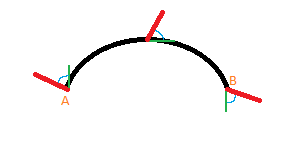
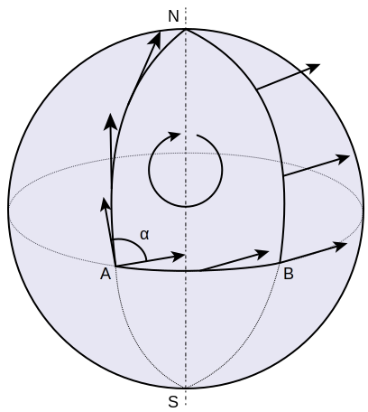
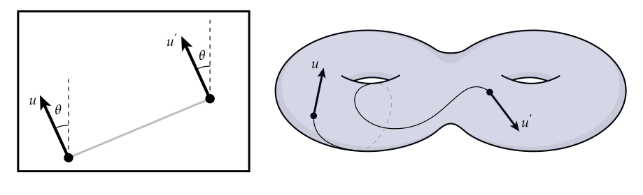

{{HEAD}}
title=Parallel transport - extremely simplified
description=An extremely simplified explanation of parallel transport put in plain language with very few mathemtical terms.

{{BODY}}

# Parallel transport (extremely simplified)

The purpose of this article is to explain the concept of "parallel transport" in an easily understandable way. This may result in some oversimplification or slightly inaccurate details, so I encourage you to research further from more reliable sources afterwards.

This article will not include the underlying mathematical equations, but will instead focus on helping you understand the concept itself using plain language.

## A curved line

The above illustration shows a 2-dimensional space with a curved line. I apologize for the lack of technical detail and accuracy.

Point A represents the start of the line and point B represents the end of the line. 
The red line protruding from point A represents the primary vector, which we want to move from point A to point B. 
The green line shows point A's tangent. In other words, its direction vector. 
The small blue curve between the primary vector and the tangent is simply the angle between the two vectors.

As we move along the curve, both the tangent and the primary vector will change. However, we can use the angle and the tangent vector (which can be calculated) to find the value of the primary vector relative to our point on the curve. This is illustrated at the halfway point of the line, and at the end of the line.

## A more detailed example

Below is a more detailed visual example, courtesy of Wikimedia Commons.

The above example consists of 3 different curves: A-N, N-B, and B-A in that order.

The tangent, and the angle between the vector and the tangent, is not shown here. Note that angle `a` is not the angle between the vector and tangent, so do not be confused.

The vector is represented with an arrow. As the vector moves along a curve, the angle between it and the tangent remains the same, even if the tangent is not represented. When the vector along line A-N reaches point N, it is that final vector, which is reused on the N-B line. Particularly, the angle between the final vector on A-N and tangent of point N on N-B, is used to find the vector on N-B. This is why the vector arrows shown on line N-B are facing a completely different direction.

This is easier to see at the end of line N-B, on point B, where the final vector is shown. Once the vector passes onto line B-A and transports the vector along it, it arrives back where it started, on point A. Notice that the vector is different.

All of this also applies to 2-dimensional paths along 3-dimensional topology/geometry. This is technically shown on the globe above, but for a more complex shape, see the right image on the illustration below ("borrowed" from [here](http://wordpress.discretization.de/geometryprocessingandapplicationsws19/connections-and-parallel-transport/)).

## Conclusion

I hope this article has helped you understand the underlying concept of parallel transport. Remember that the concept does extend significantly beyond what I have mentioned here, and that I encourage you to do more research on your own.

Should you find any mistakes or misunderstandings in the article, or if you have ideas for improvements, feel free to contact me.
